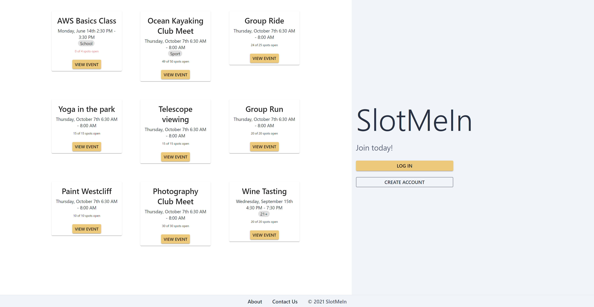

# Slot-Me-In

This is a group project written by Lucas Battelle, Ethan Perlada, William Leber, Justyn Duther, and Shirley Phuong. 

### Install
Clone the repository. Make sure npm is installed. Cd to the frontend folder and backend folder and run `npm install` in both. Install both docker and docker-compose. Run `docker pull postgres` to pull the proper docker image.
### Run
`npm start` in both the frontend and backend folder.

### Landing Page

### Home Page

